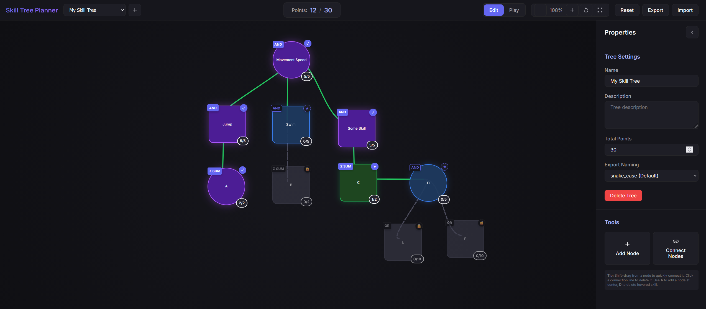

# Skill Tree Planner

A powerful, state-driven skill tree editor and simulator designed for game developers. This tool allows you to visually design complex skill systems, define dependency logic, and simulate point allocation in a live environment.

## 🚀 Features

- **Interactive Canvas**: Smoothly pan, zoom, and arrange skill nodes with a modern, responsive interface.
- **Dependency Engine**: Build complex unlock requirements using AND, OR, and SUM logic.
- **Edit & Play Modes**:
  - **Edit Mode**: Freedom to design, move nodes, and modify properties without constraints.
  - **Play Mode**: Real-time simulation of skill progression with point costs and validation.
- **Developer Friendly**:
  - **JSON Storage**: Your project is managed as a clean, versioned JSON structure.
  - **Import/Export**: Easily move your skill trees between environments or integrate them directly into your game (Unity, Godot, etc.).
- **Vanilla Core**: Built with modern ES6+ JavaScript, CSS3, and HTML5. No heavy frameworks, zero dependencies.

## 🛠️ Usage

1. Open `index.html` in any modern web browser.
2. Use the **Add Tree** button to create your first skill tree.
3. Use **Add Node** to place skills on the canvas.
4. Use **Connect Mode** (or Shift+Drag) to create dependencies between skills.
5. Switch to **Play Mode** to test your skill tree's progression logic.
6. Use **Export** to save your progress or generate a JSON file for your game.

## 📄 License

This project is licensed under the MIT License - see the [LICENSE](LICENSE) file for details.
